# NaviGreen
Sustainable transportation mobile app built with React Native and ML to optimize commute routes and detect travel modes. Uses TensorFlow for mode detection, Flask backend, and real-time APIs to provide eco-friendly routing insights and reward-based incentives.
This project demonstrates full-stack ML system design, including mobile frontend, backend APIs, ML pipelines, and data analytics workflows.

## Features
- **Transport Mode Classification**  
  Machine learning models classify user travel mode (e.g., walking, cycling, car, public transport).

- **Eco-Friendly Route Recommendations**  
  Real-time navigation APIs suggest sustainable commuting routes.

- **Reward-Based Sustainability System**  
  Users earn points for choosing environmentally friendly transportation options.

- **Backend Analytics Pipeline**  
  Python-based data processing to analyze commuting patterns and generate insights.

- **Mobile Application Interface**  
  React Native frontend for real-time commute tracking and user interaction.

## Machine Learning Pipeline

- Implemented multiple ML models including CNN, Random Forest, KNN, Gradient Boosting, and Logistic Regression

- Evaluated models using accuracy, precision, recall, ROC AUC, and confusion matrices

- Selected the best-performing model based on classification performance and robustness

## System Architecture

- <b>Frontend:</b> React Native mobile app

- <b>Backend:</b> Flask REST API

- <b>Machine Learning:</b> TensorFlow, Scikit-learn

- <b>Data Processing:</b> Python, Pandas, NumPy, Matplotlib

- <b>External Services:</b> Real-time navigation and transport APIs

## Tech Stack

- <b>Languages:</b> Python, JavaScript
- <b>Frameworks:</b> React Native, Flask, TensorFlow
- <b>ML & Data:</b> Pandas, NumPy, Scikit-learn, Matplotlib
- <b>Tools:</b> Git, Power BI (analysis phase)

## Project Structure
```
NaviGreen/
│
├── README.md
├── requirements.txt
│
├── backend/
│   ├── app.py
│   └── rfidtag.ino
│
├── mobile-app/
│   ├── src/
│   ├── App.js
│   └── package.json
│
└── images/
```

## Application Screenshots

### Final Mobile App Interface
                                      
<div align="center">
  <table>
    <!-- First Row: First 4 images -->
    <tr>
      <td style="padding: 10px; text-align: center;">
        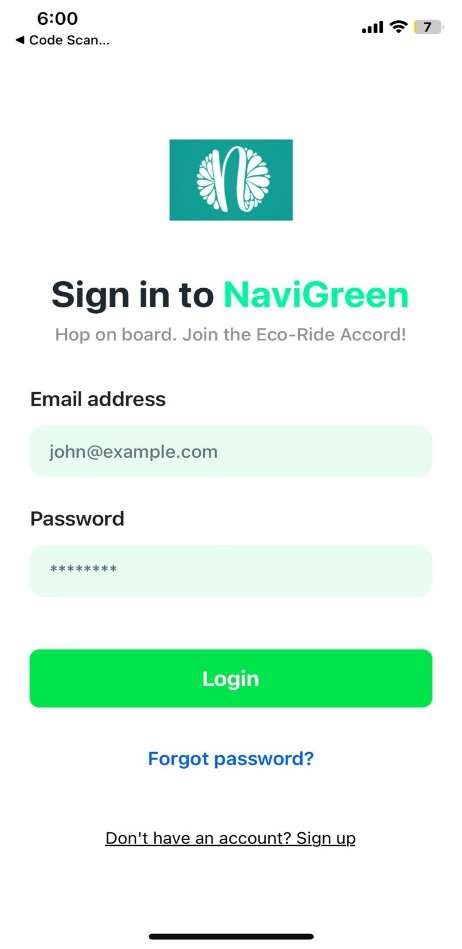<br>
        <b>Login Screen</b>
      </td>
      <td style="padding: 10px; text-align: center;">
        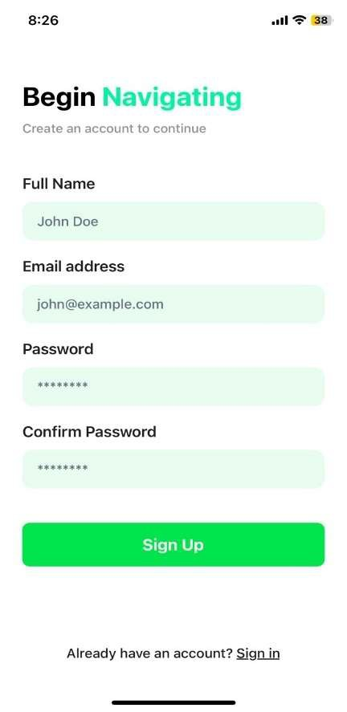<br>
        <b>Signup Screen</b>
      </td>
      <td style="padding: 10px; text-align: center;">
        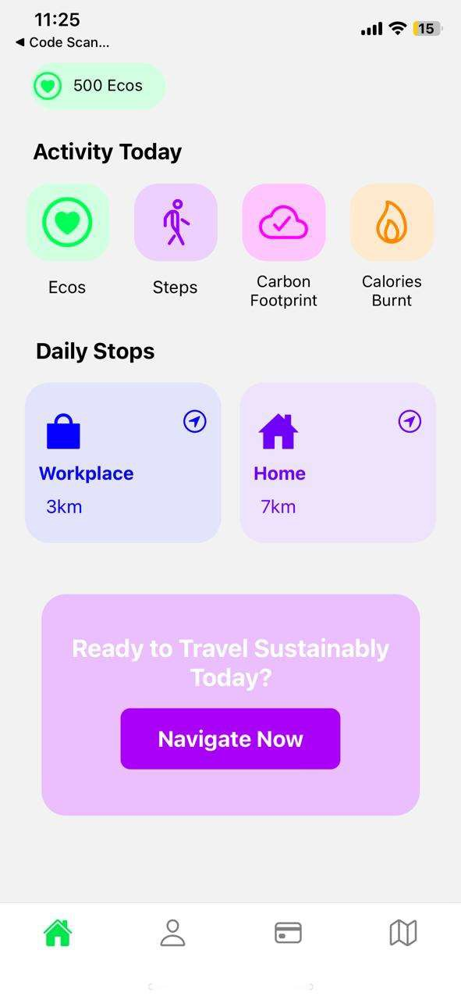<br>
        <b>Home Screen</b>
      </td>
      <td style="padding: 10px; text-align: center;">
        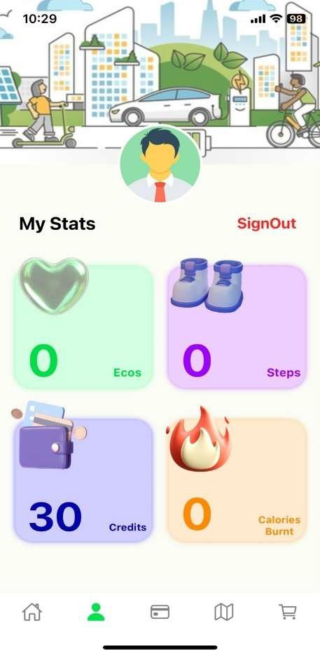<br>
        <b>Profile Screen</b>
      </td>
    </tr>
    <!-- Second Row: Next 4 images -->
    <tr>
      <td style="padding: 10px; text-align: center;">
        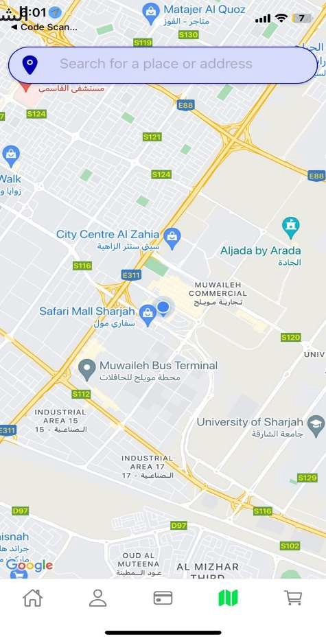<br>
        <b>Map Screen 1</b>
      </td>
      <td style="padding: 10px; text-align: center;">
        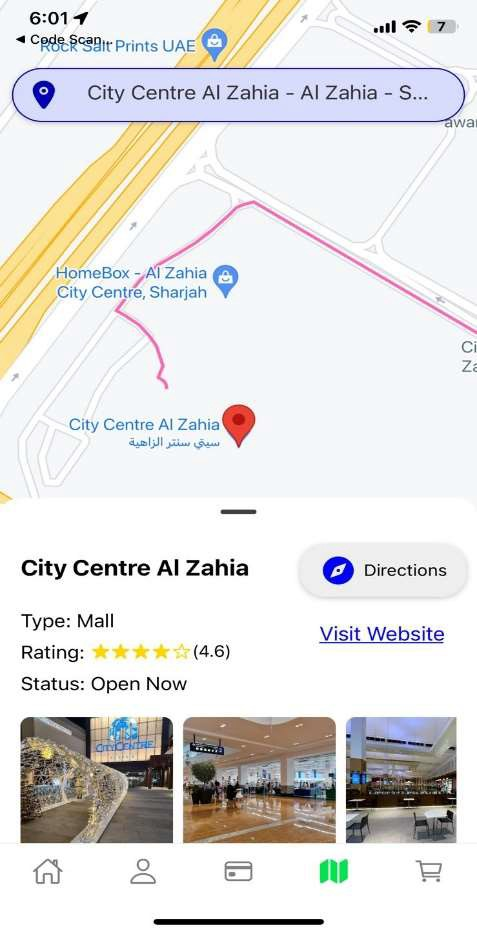<br>
        <b>Map Screen 2</b>
      </td>
      <td style="padding: 10px; text-align: center;">
        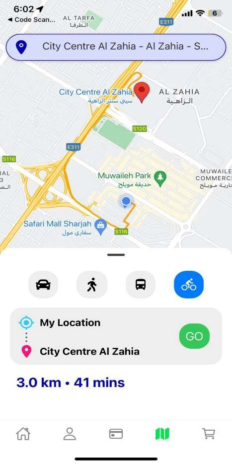<br>
        <b>Cycling Mode</b>
      </td>
      <td style="padding: 10px; text-align: center;">
        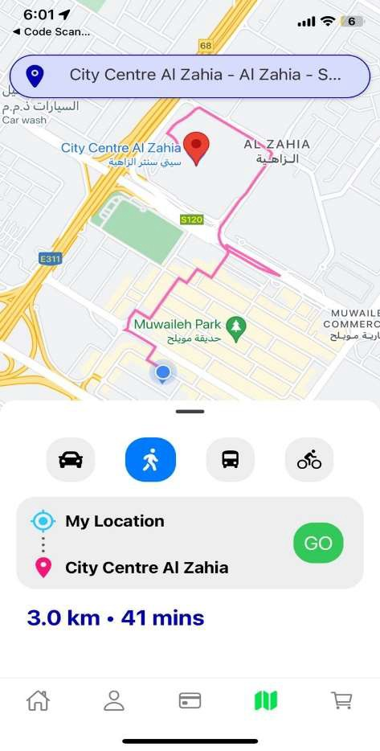<br>
        <b>Walking Mode</b>
      </td>
    </tr>
    <!-- Third Row: Next 4 images -->
    <tr>
      <td style="padding: 10px; text-align: center;">
        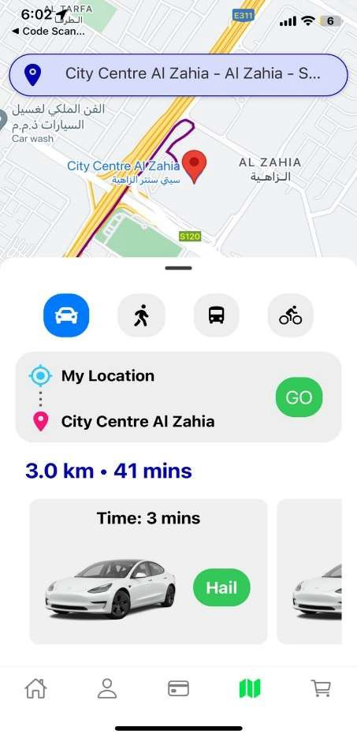<br>
        <b>Carpooling Screen</b>
      </td>
      <td style="padding: 10px; text-align: center;">
        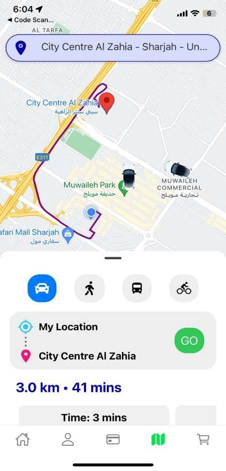<br>
        <b>Available Cars</b>
      </td>
      <td style="padding: 10px; text-align: center;">
        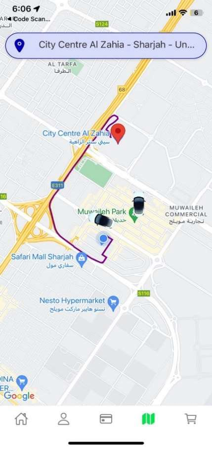<br>
        <b>Taxi Reached Screen</b>
      </td>
      <td style="padding: 10px; text-align: center;">
        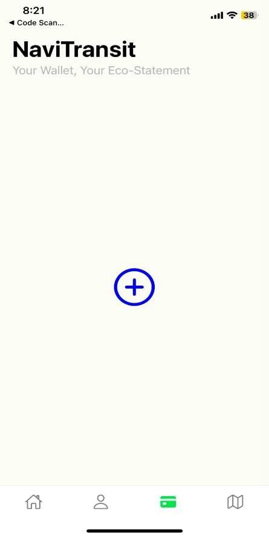<br>
        <b>Card Screen 1</b>
      </td>
    </tr>
    <!-- Third Row: Next 4 images -->
    <tr>
      <td style="padding: 10px; text-align: center;">
        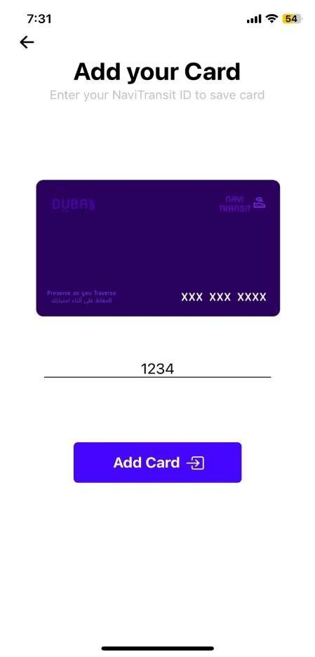<br>
        <b>Add Card</b>
      </td>
      <td style="padding: 10px; text-align: center;">
        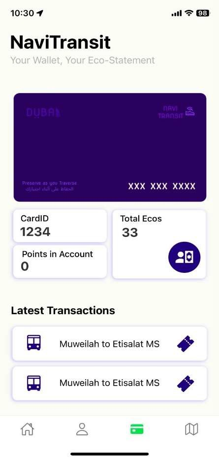<br>
        <b>Added Card Screen</b>
      </td>
      <td style="padding: 10px; text-align: center;">
        <br>
        <b>Redeem Screen</b>
      </td>
    </tr>
  </table>
</div>

## Model Evaluation Results
### Confusion Matrix (Best Model)
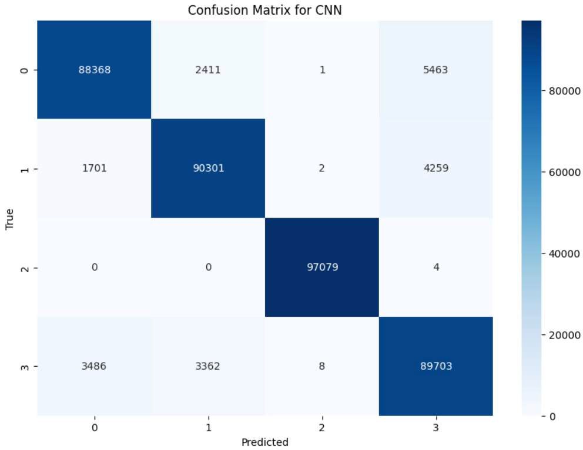

### Model Accuracy Comparison
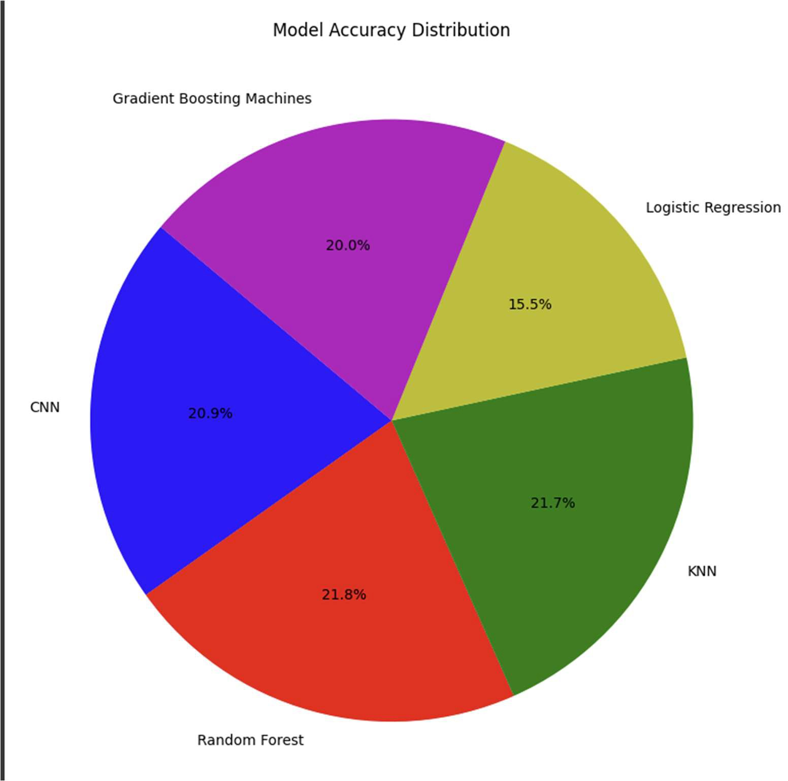

### Precision & Recall Comparison
<div align="center">
  <table>
    <tr>
      <td style="padding: 10px; text-align: center;">
        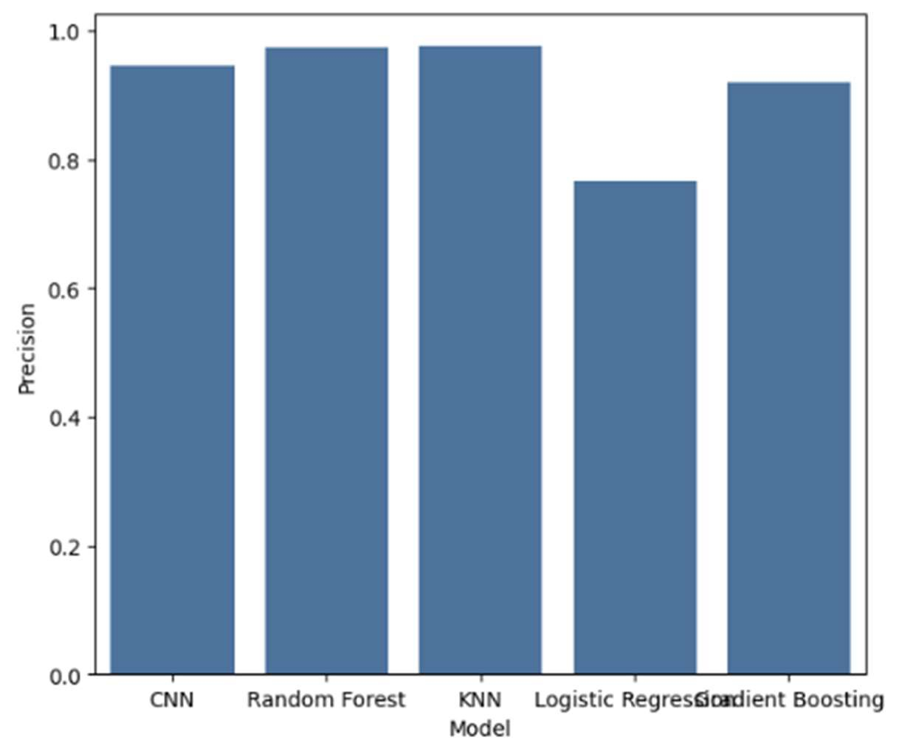<br>
        <b>Model Precision comparison - bar graph</b>
      </td>
      <td style="padding: 10px; text-align: center;">
        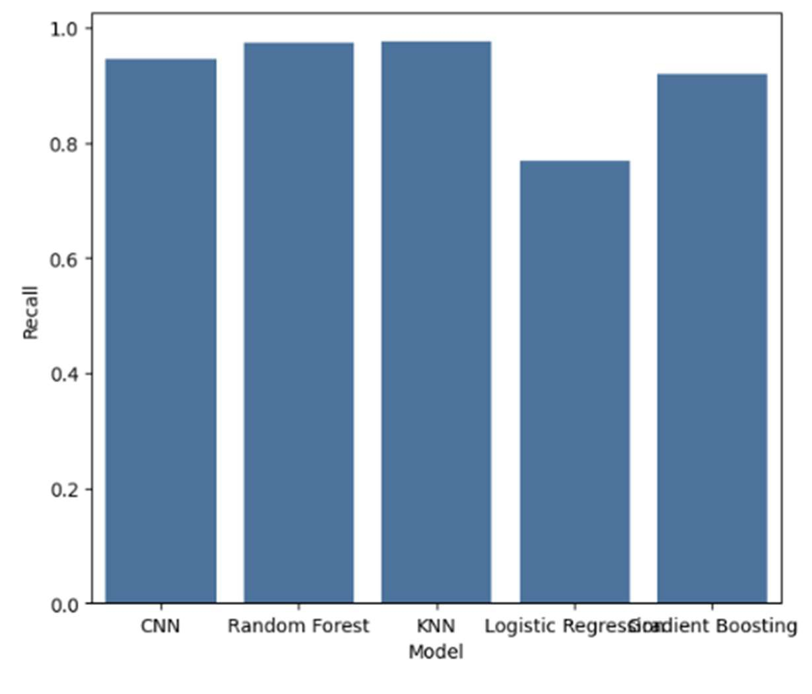<br>
        <b>Model Recall comparison - bar graph.</b>
      </td>
    </tr>
 </table>
</div>
  
### ROC AUC Comparison
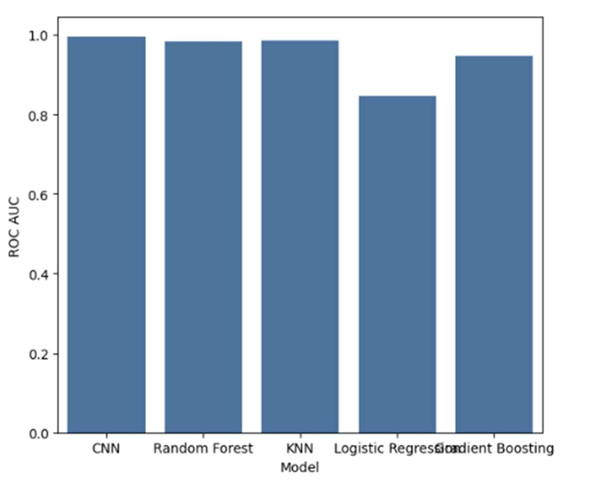

## Model Selection and Discussion

Random Forest achieved slightly higher overall accuracy; however, CNN demonstrated better class discrimination based on ROC AUC and scalability for complex, high-dimensional data. Given the expected growth in dataset size and feature complexity, CNN was selected as the final model for deployment.


## Future Improvements

- Carbon footprint estimation per trip
- Personalized route recommendations using reinforcement learning
- Cloud deployment for scalable analytics
- Integration with smart city datasets

## Research Context
This project demonstrates end-to-end machine learning system design, including mobile development, backend services, ML pipelines, and data analytics workflows.
